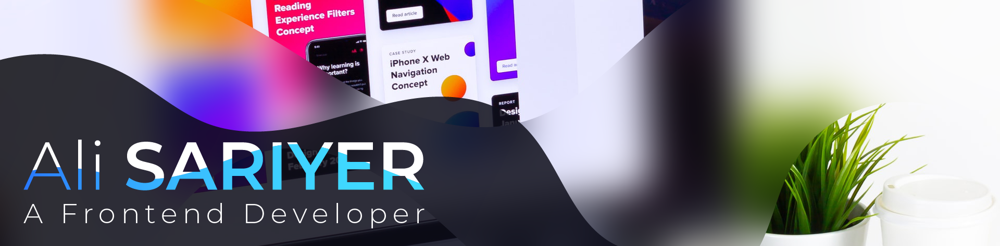

# Hi 👋, I'm Ali Sariyer
## A passionate frontend developer from the Netherlands

- 🔭 I’m currently working on [A movie theater web application](https://github.com/Amberbm/WebsiteAvatar)

- 🌱 I’m currently learning **Node.js and Express.js**

- 👨‍💻 All of my projects are available at [my github page](my github page)

- 📝 I regularly write articles on ...

- 💬 Ask me about **react**

- 📫 How to reach me ...

- 📄 Know about my experiences [https://linkedin.com/in/alisariyer](https://linkedin.com/in/alisariyer)

### Connect with me:

<h3 align="left">Languages and Tools:</h3>

***

